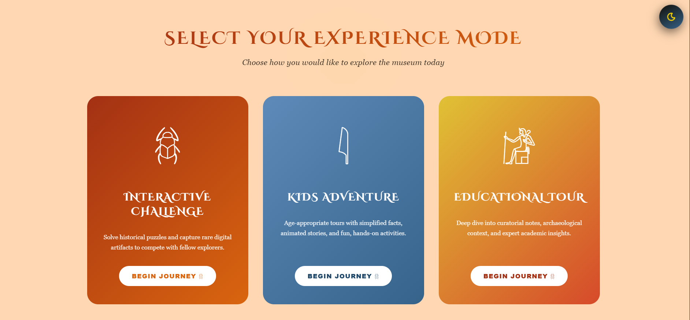
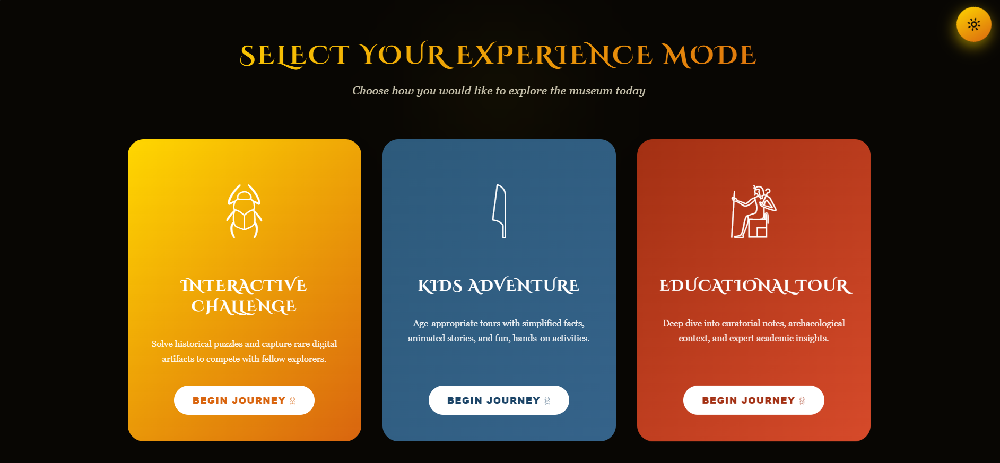
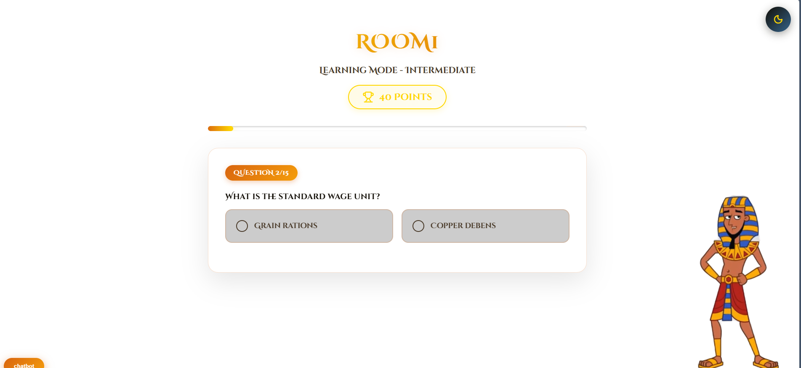

<div align="center">

# 𓂀 GEM Feedback Experience
### *Grand Egyptian Museum — GEM Hackathon 2025, 3rd Edition*

> **"Data-Driven GEM: Listening to Every Voice"**
> 
> *Transforming visitor feedback into an immersive journey through 5,000 years of history.*

[](https://gem.eg)
[](https://www.w3.org/WAI/WCAG21/quickref/)
[]()
[]()

</div>

---

## 📜 The Challenge

The Grand Egyptian Museum's 3rd Hackathon Series challenged innovators, tech minds, and creatives under the theme **"Data-Driven GEM: Listening to Every Voice"** — reimagining how the museum interacts with its visitors and collecting meaningful feedback at scale.

**The core problem:** Traditional feedback forms are ignored. Visitors walk past kiosks, skip surveys, and leave no data behind — making it impossible for the museum to understand real visitor sentiment across its massive 12-gallery complex housing over 100,000 artifacts.

**Our solution:** Don't ask for feedback. Make it part of the adventure.

---

## 💡 Our Approach

We built a **gamified, accessible, multi-experience web platform** that embeds feedback collection invisibly inside an engaging storytelling journey — so visitors fill out feedback without ever feeling like they're filling out a form.

### Key Features

| Feature | Description |
|--------|-------------|
| 🎮 **Gamification** | Three distinct journey modes adapted to every visitor type |
| ♿ **Full Accessibility** | Suit Color blindness + WCAG-compliant design |
| 🌗 **Dark / Light Mode** | Toggle for comfort in museum lighting conditions |
| 🗺️ **Interactive Gallery Map** | Real-time location awareness across all 12 GEM halls |
| 🤖 **Animated Kingdom Guide** | A cartoon character from the era narrates and asks hidden feedback questions |
| 📸 **Photo Leaderboard** | Visitor photography ranked hourly by AI analysis and featured live |

---

## 🖼️ Screenshots

### Main Landing Page

*The portal entrance — built with modern UX principles.*

---

### 🌗 Light & Dark Mode
| Light Mode | Dark Mode |
|-----------|-----------|
|  |  |

*One toggle. Full comfort — whether you're in the sunlit atrium or the dimly lit Tutankhamun gallery.*

Visitors choose one of **three immersive experience modes** before entering:
```
𓆣  Interactive Challenge
    Capture unique images
    to compete with fellow explorers.

𓇋  Kids Adventure
    Age-appropriate tours with simplified facts, animated stories,
    and fun journey.

𓁈  Educational Tour
    Deep dive into archaeological context,
    and expert academic insights.
```
---

### Choosing Your Journey
Visitors choose one of **three immersive difficulty level** before entering:


---

### 🗺️ Gallery Map Selection


After choosing a mode, visitors see a **live interactive map of all 12 GEM galleries**, organized by historical period:

- Old Kingdom
- Middle Kingdom  
- New Kingdom
- Late Period
- Greco-Roman Period
- *(and more...)*

The visitor taps the gallery they are currently standing in — activating a location-aware experience for that exact hall.

---

### 𓁺 Character Narration


Once a gallery is selected, a **cartoon character from that historical era** appears and comes to life. For example, selecting the Middle Kingdom gallery summons **Kaeber** — an animated ancient Egyptian guide who:

- Narrates the story of his kingdom in a conversational tone
- Points out key artifacts around the visitor
- Shares historical context matched to the visitor's chosen experience level
- **Seamlessly asks hidden feedback questions mid-story** — so the visitor answers without realizing it's a survey



---

## 📸 Photo Experience & Hourly Leaderboard

Visitors in **Interactive Challenge** mode can:

1. **Browse the gallery map** and choose a location to photograph
2. **Capture a photo** inside the museum using the in-app camera
3. To submit photo he fill small feedback 
4. **See their photo analyzed** automatically

Every hour, the **top-ranked photos** are featured on a live leaderboard displayed at our website, showing:

```
🥇  [Photo Thumbnail]  — Visitor Name
     📍 Tutankhamun Gallery  |  Score: 94/100
     ⏱ Captured: 2:34 PM    
```

This creates a social, competitive layer that encourages deeper exploration across galleries.

---

## ♿ Accessibility

We took accessibility seriously to suit each and every tourist.

- **Color blindness simulation checker** built into the design system 
- All UI elements tested with color contrast tools meeting **WCAG 2.1 AA**
- Dark / Light mode toggle for photosensitivity and lighting conditions
---

## Tech Stack

| Layer | Technology |
|-------|-----------|
| Frontend | React.js |
| Styling | CSS|
| Accessibility | Custom color that suits all types of  color blindness + Audio questions for deaf people and kids |
| Deployment | Vite |

---

<div align="center">

𓂀 &nbsp;&nbsp; 𓆣 &nbsp;&nbsp; 𓇋 &nbsp;&nbsp; 𓁈 &nbsp;&nbsp; 𓂀

</div>
